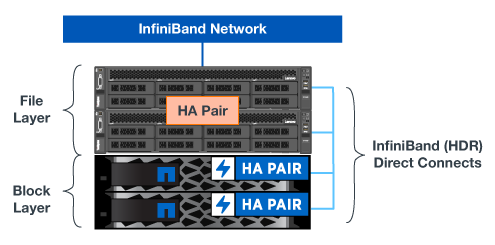

= Panoramica dell'architettura
:hardbreaks:
:allow-uri-read: 
:nofooter: 
:icons: font
:linkattrs: 
:imagesdir: ./media/

[role="lead"]
La soluzione BeeGFS su NetApp include considerazioni di progettazione architetturale utilizzate per determinare le apparecchiature, il cablaggio e le configurazioni specifiche richieste per supportare i carichi di lavoro validati.

== Architettura a blocchi

Il file system BeeGFS può essere implementato e scalato in diversi modi, a seconda dei requisiti di storage. Ad esempio, i casi di utilizzo che includono principalmente numerosi file di piccole dimensioni trarranno beneficio da una maggiore capacità e performance dei metadati, mentre i casi di utilizzo che presentano meno file di grandi dimensioni potrebbero favorire una maggiore capacità di storage e performance per i contenuti dei file effettivi. Queste considerazioni multiple hanno un impatto sulle diverse dimensioni dell'implementazione del file system parallelo, che aggiunge complessità alla progettazione e all'implementazione del file system.

Per affrontare queste sfide, NetApp ha progettato un'architettura standard basata su building block che consente di scalare ciascuna di queste dimensioni. In genere, gli elementi di base BeeGFS vengono implementati in uno dei tre profili di configurazione seguenti:

* Un singolo building block di base, che include gestione BeeGFS, metadati e servizi di storage
* Metadati BeeGFS e building block dello storage
* Un building block per lo storage BeeGFS

L'unica modifica hardware tra queste tre opzioni è l'utilizzo di dischi più piccoli per i metadati BeeGFS. In caso contrario, tutte le modifiche di configurazione vengono applicate tramite software. Inoltre, con Ansible come motore di implementazione, la configurazione del profilo desiderato per un particolare building block rende semplici le attività di configurazione.

Per ulteriori dettagli, vedere <<Progettazione hardware verificata>>.

== Servizi del file system

Il file system BeeGFS include i seguenti servizi principali:

* *Servizio di gestione.* registra e monitora tutti gli altri servizi.
* *Servizio di storage.* Memorizza il contenuto del file utente distribuito, noto come file di blocco dei dati.
* *Servizio metadati.* tiene traccia del layout del file system, della directory, degli attributi dei file e così via.
* *Servizio client.* consente di attivare il file system per accedere ai dati memorizzati.

La figura seguente mostra i componenti della soluzione BeeGFS e le relazioni utilizzate con i sistemi NetApp e-Series.

image:../media/beegfs-components.png[""]

In qualità di file system parallelo, BeeGFS esegue lo striping dei propri file su più nodi server per massimizzare le performance di lettura/scrittura e la scalabilità. I nodi server lavorano insieme per fornire un singolo file system che può essere montato e accessibile contemporaneamente da altri nodi server, comunemente noti come _client_. Questi client possono visualizzare e utilizzare il file system distribuito in modo simile a un file system locale come NTFS, XFS o ext4.

I quattro servizi principali vengono eseguiti su un'ampia gamma di distribuzioni Linux supportate e comunicano tramite qualsiasi rete compatibile con TCP/IP o RDMA, tra cui InfiniBand (IB), Omni-Path (OPA) e RDMA over Converged Ethernet (RoCE). I servizi server BeeGFS (gestione, storage e metadati) sono daemon dello spazio utente, mentre il client è un modulo kernel nativo (senza patch). Tutti i componenti possono essere installati o aggiornati senza riavviare ed è possibile eseguire qualsiasi combinazione di servizi sullo stesso nodo.

== Architettura HA

BeeGFS su NetApp espande le funzionalità dell'edizione Enterprise di BeeGFS creando una soluzione completamente integrata con l'hardware NetApp che consente un'architettura ha (Shared Disk High Availability).

NOTE: Sebbene l'edizione della community BeeGFS possa essere utilizzata gratuitamente, l'edizione Enterprise richiede l'acquisto di un contratto di abbonamento al supporto professionale da parte di un partner come NetApp. L'edizione Enterprise consente di utilizzare diverse funzionalità aggiuntive, tra cui resilienza, applicazione delle quote e pool di storage.

La figura seguente confronta le architetture ha shared-nothing e shared-disk.

image:../media/beegfs-design-image1.png[""]

Per ulteriori informazioni, vedere https://www.netapp.com/blog/high-availability-beegfs/["Annuncio dell'alta disponibilità per BeeGFS supportato da NetApp"^].

== Nodi verificati

La soluzione BeeGFS on NetApp ha verificato i nodi elencati di seguito.

[cols="10%,20%,70%"]
|===
| Nodo | Hardware | Dettagli 

| Blocco | Sistema storage NetApp EF600 | Un array storage 2U all-NVMe ad alte performance progettato per i carichi di lavoro esigenti. 

.2+| File | Server Lenovo ThinkSystem SR665 V3 | Un server 2U a due socket con PCIe 5,0, due processori AMD EPYC 9124. Per ulteriori informazioni su Lenovo SR665 V3, vedere https://lenovopress.lenovo.com/lp1608-thinksystem-sr665-v3-server["Il sito Web di Lenovo"^]. 

| Server Lenovo ThinkSystem SR665 | Un server 2U a due socket con PCIe 4,0, due processori AMD EPYC 7003. Per ulteriori informazioni su Lenovo SR665, vedere https://lenovopress.lenovo.com/lp1269-thinksystem-sr665-server["Il sito Web di Lenovo"^]. 
|===

== Progettazione hardware verificata

I building block della soluzione (mostrati nella figura seguente) utilizzano i server dei nodi di file verificati per il livello di file BeeGFS e due sistemi storage EF600 come livello di blocchi.

La soluzione BeeGFS su NetApp viene eseguita in tutti gli elementi di base dell'implementazione. Il primo building block implementato deve eseguire i servizi di gestione, metadati e storage di BeeGFS (noto come building block di base). Tutti i building block successivi possono essere configurati con il software per estendere metadati e servizi di storage o per fornire esclusivamente servizi storage. Questo approccio modulare consente di scalare il file system in base alle esigenze di un carico di lavoro utilizzando al tempo stesso le stesse piattaforme hardware sottostanti e il design a building block.

È possibile implementare fino a cinque elementi di base per formare un cluster Linux ha autonomo. Ciò ottimizza la gestione delle risorse con pacemaker e mantiene una sincronizzazione efficiente con Corosync. Uno o più cluster ha BeeGFS standalone vengono combinati in modo da creare un file system BeeGFS accessibile ai client come namespace singolo di storage. Sul lato hardware, un singolo rack 42U può ospitare fino a cinque building block, insieme a due switch InfiniBand 1U GB per la rete storage/dati. Per una rappresentazione visiva, vedere la figura riportata di seguito.

NOTE: Per stabilire il quorum nel cluster di failover sono necessari almeno due building block. Un cluster a due nodi presenta limitazioni che potrebbero impedire il corretto funzionamento del failover. È possibile configurare un cluster a due nodi incorporando un terzo dispositivo come tiebreaker; tuttavia, questa documentazione non lo descrive.

image:../media/beegfs-design-image3.png[""]

== Ansible

BeeGFS su NetApp viene fornito e implementato utilizzando l'automazione Ansible, che è ospitata su GitHub e Ansible Galaxy (la raccolta BeeGFS è disponibile presso https://galaxy.ansible.com/netapp_eseries/beegfs["Ansible Galaxy"^] e. https://github.com/netappeseries/beegfs/["GitHub e-Series di NetApp"^]). Sebbene Ansible sia testato principalmente con l'hardware utilizzato per assemblare i blocchi di base BeeGFS, è possibile configurarlo per l'esecuzione su qualsiasi server basato su x86 utilizzando una distribuzione Linux supportata.

Per ulteriori informazioni, vedere https://www.netapp.com/blog/deploying-beegfs-eseries/["Implementazione di BeeGFS con storage e-Series"^].
