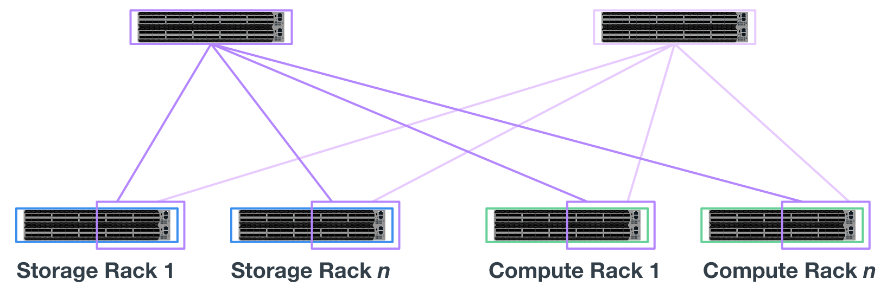

= Panoramica dell'architettura
:hardbreaks:
:allow-uri-read: 
:nofooter: 
:icons: font
:linkattrs: 
:imagesdir: ./media/

[role="lead"]
La soluzione BeeGFS su NetApp include considerazioni di progettazione architetturale utilizzate per determinare le apparecchiature, il cablaggio e le configurazioni specifiche richieste per supportare i carichi di lavoro validati.

== Architettura a blocchi

Il file system BeeGFS può essere implementato e scalato in diversi modi, a seconda dei requisiti di storage. Ad esempio, i casi di utilizzo che includono principalmente numerosi file di piccole dimensioni trarranno beneficio da una maggiore capacità e performance dei metadati, mentre i casi di utilizzo che presentano meno file di grandi dimensioni potrebbero favorire una maggiore capacità di storage e performance per i contenuti dei file effettivi. Queste considerazioni multiple hanno un impatto sulle diverse dimensioni dell'implementazione del file system parallelo, che aggiunge complessità alla progettazione e all'implementazione del file system.

Per affrontare queste sfide, NetApp ha progettato un'architettura standard basata su building block che consente di scalare ciascuna di queste dimensioni. In genere, gli elementi di base BeeGFS vengono implementati in uno dei tre profili di configurazione seguenti:

* Un singolo building block di base, che include gestione BeeGFS, metadati e servizi di storage
* Metadati BeeGFS e building block dello storage
* Un building block per lo storage BeeGFS

L'unica modifica hardware tra queste tre opzioni è l'utilizzo di dischi più piccoli per i metadati BeeGFS. In caso contrario, tutte le modifiche di configurazione vengono applicate tramite software. Inoltre, con Ansible come motore di implementazione, la configurazione del profilo desiderato per un particolare building block rende semplici le attività di configurazione.

Per ulteriori dettagli, vedere <<Progettazione hardware verificata>>.

== Servizi del file system

Il file system BeeGFS include i seguenti servizi principali:

* *Servizio di gestione.* registra e monitora tutti gli altri servizi.
* *Servizio di storage.* Memorizza il contenuto del file utente distribuito, noto come file di blocco dei dati.
* *Servizio metadati.* tiene traccia del layout del file system, della directory, degli attributi dei file e così via.
* *Servizio client.* consente di attivare il file system per accedere ai dati memorizzati.

La figura seguente mostra i componenti della soluzione BeeGFS e le relazioni utilizzate con i sistemi NetApp e-Series.

image:../media/beegfs-components.png[""]

In qualità di file system parallelo, BeeGFS esegue lo striping dei propri file su più nodi server per massimizzare le performance di lettura/scrittura e la scalabilità. I nodi server lavorano insieme per fornire un singolo file system che può essere montato e accessibile contemporaneamente da altri nodi server, comunemente noti come _client_. Questi client possono visualizzare e utilizzare il file system distribuito in modo simile a un file system locale come NTFS, XFS o ext4.

I quattro servizi principali vengono eseguiti su un'ampia gamma di distribuzioni Linux supportate e comunicano tramite qualsiasi rete compatibile con TCP/IP o RDMA, tra cui InfiniBand (IB), Omni-Path (OPA) e RDMA over Converged Ethernet (RoCE). I servizi server BeeGFS (gestione, storage e metadati) sono daemon dello spazio utente, mentre il client è un modulo kernel nativo (senza patch). Tutti i componenti possono essere installati o aggiornati senza riavviare ed è possibile eseguire qualsiasi combinazione di servizi sullo stesso nodo.

== Nodi verificati

La soluzione BeeGFS su NetApp include i seguenti nodi verificati: Il sistema di storage NetApp EF600 (nodo a blocchi) e il server Lenovo ThinkSystem SR665 (nodo file).

=== Nodo a blocchi: Sistema storage EF600

L'array all-flash NetApp EF600 offre un accesso coerente e quasi in tempo reale ai dati, supportando contemporaneamente qualsiasi numero di workload. Per consentire un'alimentazione rapida e continua dei dati alle applicazioni ai e HPC, i sistemi storage EF600 offrono fino a due milioni di IOPS in lettura memorizzati nella cache, tempi di risposta inferiori a 100 microsecondi e larghezza di banda in lettura sequenziale di 42 Gbps in un'unica enclosure.

=== Nodo file: Server Lenovo ThinkSystem SR665

SR665 è un server 2U a due socket dotato di PCIe 4.0. Se configurato per soddisfare i requisiti di questa soluzione, offre prestazioni elevate per l'esecuzione dei file service BeeGFS in una configurazione ben bilanciata con la disponibilità di throughput e IOPS forniti dai nodi e-Series collegati direttamente.

Per ulteriori informazioni su Lenovo SR665, vedere https://lenovopress.com/lp1269-thinksystem-sr665-server["Il sito Web di Lenovo"^].

== Progettazione hardware verificata

Gli elementi di base della soluzione (illustrati nella figura seguente) utilizzano due server PCIe 4.0 a doppio socket per il file layer BeeGFS e due sistemi storage EF600 come layer di blocchi.

image:../media/beegfs-design-image2-small.png[""]

NOTE: Poiché ogni building block include due nodi di file BeeGFS, per stabilire il quorum nel cluster di failover sono necessari almeno due building block. Sebbene sia possibile configurare un cluster a due nodi, questa configurazione presenta dei limiti che potrebbero impedire il failover. Se si richiede un cluster a due nodi, è possibile incorporare un terzo dispositivo come spareggio (tuttavia, tale progetto non è trattato in questo sito).

Ogni building block offre alta disponibilità attraverso una progettazione hardware a due livelli che separa i domini di errore per i layer di file e blocchi. Ogni Tier può eseguire il failover in modo indipendente, fornendo una maggiore resilienza e riducendo il rischio di guasti a cascata. L'utilizzo di HDR InfiniBand in combinazione con NVMeOF offre un throughput elevato e una latenza minima tra file e nodi a blocchi, con ridondanza completa e un'oversubscription di collegamento sufficiente per evitare che il design disaggregato diventi un collo di bottiglia, anche quando il sistema è parzialmente degradato.

La soluzione BeeGFS su NetApp viene eseguita in tutti gli elementi di base dell'implementazione. Il primo building block implementato deve eseguire i servizi di gestione, metadati e storage BeeGFS (indicati come building block di base). Tutti gli elementi di base successivi vengono configurati tramite software per eseguire i metadati e i servizi storage BeeGFS o solo i servizi storage. La disponibilità di diversi profili di configurazione per ciascun building block consente la scalabilità dei metadati del file system o della capacità e delle performance dello storage utilizzando le stesse piattaforme hardware sottostanti e la stessa progettazione di building block.

Fino a cinque building block vengono combinati in un cluster Linux ha standalone, garantendo un numero ragionevole di risorse per cluster resource manager (pacemaker) e riducendo l'overhead di messaggistica richiesto per mantenere i membri del cluster sincronizzati (Corosync). Si consiglia di utilizzare almeno due building block per cluster per consentire a un numero sufficiente di membri di stabilire il quorum. Uno o più di questi cluster BeeGFS ha standalone vengono combinati per creare un file system BeeGFS (mostrato nella figura seguente) accessibile ai client come singolo namespace dello storage.

image:../media/beegfs-design-image3.png[""]

Anche se in ultima analisi il numero di building block per rack dipende dai requisiti di alimentazione e raffreddamento per un determinato sito, La soluzione è stata progettata in modo da poter implementare fino a cinque building block in un singolo rack 42U, pur fornendo spazio per due switch InfiniBand 1U utilizzati per la rete storage/dati. Ogni building block richiede otto porte IB (quattro per switch per la ridondanza), quindi cinque building block lasciano metà delle porte su uno switch InfiniBand HDR a 40 porte (come NVIDIA QM8700) disponibile per implementare una topologia fat-tree o simile senza blocchi. Questa configurazione garantisce che il numero di rack di storage o di calcolo/GPU possa essere aumentato senza colli di bottiglia nella rete. In alternativa, è possibile utilizzare un fabric di storage con overoveroveroveroveroversured su raccomandazione del vendor del fabric di storage.

La seguente immagine mostra una topologia ad albero adiposo a 80 nodi.

Utilizzando Ansible come motore di implementazione per implementare BeeGFS su NetApp, gli amministratori possono mantenere l'intero ambiente utilizzando l'infrastruttura moderna come procedure di codice. In questo modo si semplifica drasticamente quello che altrimenti sarebbe un sistema complesso, consentendo agli amministratori di definire e regolare la configurazione in un'unica posizione, garantendo che venga applicata in modo coerente indipendentemente dalla scalabilità dell'ambiente. La raccolta BeeGFS è disponibile all'interno del sito https://galaxy.ansible.com/netapp_eseries/beegfs["Ansible Galaxy"^] e. https://github.com/netappeseries/beegfs/["GitHub e-Series di NetApp"^].
